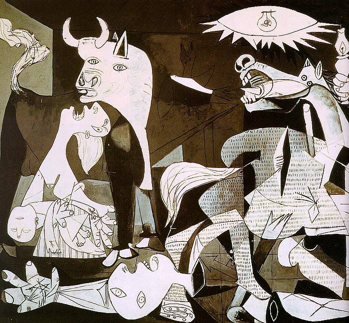

# Machine Generated Captions for Best Artworks

There are many image caption datasets like MS-COCO or Flickr-30k. The images in those datasets are mostly photos. For some reason we needed captions for paintings but failed to find one. As a solution, we downloaded a [dataset of famous artworks from kaggle](https://www.kaggle.com/datasets/ikarus777/best-artworks-of-all-time), and generated English/Korean captions for every image in it using our [TUNiBridge's image API](https://demo.tunibridge.ai/image). You can download the data [here](https://github.com/tunib-ai/artwork_captions/blob/main/generated_captions_for_best_artworks.tsv).

## Example
* Artist: Pablo Picasso
* Image: Pablo_Picasso_422.jpg 

* English: a painting of a cow and other animals on a wall	
* Korean: 벽에 있는 소와 다른 동물들의 그림
